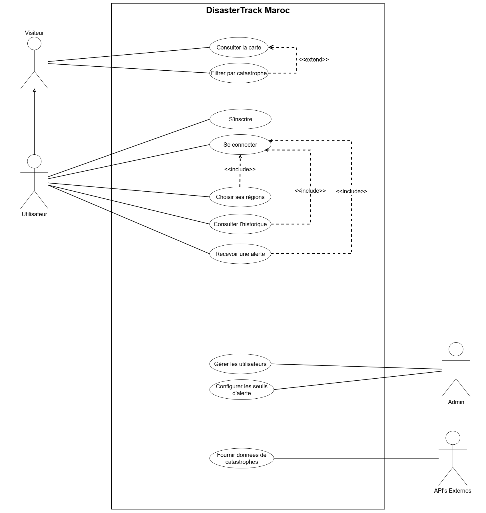
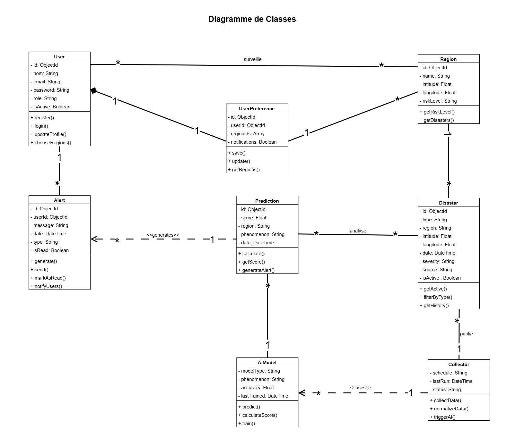

# 🚨 Suivi des Catastrophes au Maroc

**Application web de suivi et d'alerte sur les catastrophes naturelles au Maroc**

> Projet de Fin d'Études (PFE) — 2026

---

## 📋 Table des matières

- [Description](#description)
- [Caractéristiques](#caractéristiques)
- [Architecture](#architecture)
- [Diagrammes UML](#diagrammes-uml)
- [Les Acteurs](#les-acteurs)
- [Besoins Fonctionnels](#besoins-fonctionnels)
- [Installation](#installation)
- [Utilisation](#utilisation)
- [Équipe](#équipe)

---

## 🎯 Description

**Suivi des Catastrophes au Maroc** est une application web conçue pour surveiller et alerter les utilisateurs sur les catastrophes naturelles (séismes, inondations, incendies) qui surviennent au Maroc. L'application collecte des données en temps réel via plusieurs APIs externes et utilise l'intelligence artificielle pour calculer les risques par région.

### 🌍 Objectifs Principaux

✅ Fournir une carte interactive du Maroc en temps réel  
✅ Alerter les utilisateurs sur les catastrophes naturelles  
✅ Offrir un historique des événements par région  
✅ Permettre aux utilisateurs de personnaliser leurs alertes  
✅ Administrer l'application et gérer les seuils d'alerte  

---

## ⭐ Caractéristiques

### Pour les Visiteurs Anonymes
- 🗺️ Consultation de la carte du Maroc interactive
- 📍 Visualisation des catastrophes actives
- 🔍 Filtrage par type de catastrophe (séismes, inondations, incendies)
- 📊 Détails complets de chaque événement

### Pour les Utilisateurs Enregistrés
- 🔐 Création d'un compte personnel
- 🚨 Alertes en temps réel personnalisées
- 🎯 Sélection des régions à surveiller
- 📈 Accès à l'historique des alertes
- ⚙️ Gestion du profil et des préférences

### Pour les Administrateurs
- 👥 Gestion des comptes utilisateurs
- ⚖️ Configuration des seuils d'alerte
- 📋 Consultation des logs et erreurs
- 🔄 Collecte manuelle de données
- 🔌 Activation/désactivation des sources externes

---

## 🏗️ Architecture

### 🔗 Sources de Données Externes

| Source | Type de Données |
|--------|---|
| **USGS** 🏔️ | Données sismiques en temps réel |
| **NASA FIRMS / EONET** 🛰️ | Incendies et événements naturels |
| **OpenWeatherMap** 🌤️ | Météo (température, humidité, vent, précipitations) |
| **OpenStreetMap** 🗺️ | Tuiles cartographiques interactives |

### 🤖 Composants Principaux

- **Frontend** : Interface web réactive avec Leaflet/Mapbox
- **Backend API** : Service REST pour la gestion des données
- **Collecteur Automatique** : Celery - Collecte horaire via les APIs externes
- **Base de Données** : MongoDB - Stockage normalisé des événements
- **Modèle IA** : Calcul du score de risque par région (0% → 100%)
- **Système d'Alertes** : Notifications aux utilisateurs

---

## 📐 Diagrammes UML

### Diagramme de Cas d'Utilisation



Ce diagramme montre les interactions entre les différents acteurs (Visiteur, Utilisateur Enregistré, Administrateur) et les fonctionnalités principales de l'application.

### Diagramme de Classes



Architecture des classes principales de l'application montrant les relations entre les entités (User, Event, Alert, Region, etc.).

### Diagrammes de Séquence

Les diagrammes de séquence détaillent les flux d'interactions pour chaque cas d'utilisation principal.

> 📁 Voir le dossier [docs/uml/exported/sequence/](docs/uml/exported/sequence/) pour les diagrammes de séquence complets.

---

## 👥 Les Acteurs

### Utilisateurs Primaires

#### 1. **Visiteur Anonyme** 👤
- Accède à la carte sans compte
- Consulte les catastrophes actives au Maroc
- Filtre par type de catastrophe
- Ne reçoit pas d'alertes personnalisées

#### 2. **Utilisateur Enregistré** 🔐
- Crée un compte et se connecte
- Choisit ses régions à surveiller
- Reçoit des alertes en temps réel
- Consulte l'historique de ses alertes

#### 3. **Administrateur** 🛡️
- Gère les comptes utilisateurs
- Configure les seuils d'alerte
- Surveille les logs et performances
- Force manuellement une collecte de données

### Acteurs Automatiques

#### 4. **Collecteur Automatique (Celery)** ⚙️
- Se réveille automatiquement toutes les heures
- Interroge les APIs externes
- Normalise et stocke les données dans MongoDB
- Déclenche le modèle IA et génère les alertes

---

## ✅ Besoins Fonctionnels

### Visiteur Anonyme
- [ ] Consulter la carte du Maroc
- [ ] Voir les catastrophes actives
- [ ] Filtrer par type (séismes, inondations, incendies)
- [ ] Voir les détails d'un événement

### Utilisateur Enregistré
- [ ] S'inscrire et se connecter
- [ ] Choisir ses régions à surveiller
- [ ] Recevoir des alertes en temps réel
- [ ] Consulter l'historique des alertes
- [ ] Gérer son profil et ses préférences

### Administrateur
- [ ] Gérer les comptes utilisateurs
- [ ] Configurer les seuils d'alerte par type
- [ ] Consulter les logs et erreurs
- [ ] Forcer une collecte manuelle de données
- [ ] Activer/désactiver les sources externes

### Collecteur Automatique (Celery)
- [ ] Interroger les APIs toutes les heures
- [ ] Normaliser et stocker les données
- [ ] Calculer un score de risque (0% → 100%) par région
- [ ] Déclencher une alerte si seuil dépassé
- [ ] Envoyer les alertes aux utilisateurs concernés

---

## 🚀 Installation

### Prérequis

- Python 3.8+
- MongoDB
- Node.js (pour le frontend)

### Étapes d'Installation

```bash
# Cloner le repository
git clone https://github.com/yourusername/suivi-catastrophes-maroc.git
cd suivi-catastrophes-maroc

# Installer les dépendances backend
pip install -r requirements.txt

# Configurer la base de données
# Créer un fichier .env avec vos configurations

# Installer les dépendances frontend
cd frontend
npm install

# Démarrer l'application
npm start
```

---

## 💻 Utilisation

### Accès à l'Application

1. Ouvrez votre navigateur et accédez à `http://localhost:3000`
2. Consultez la carte des catastrophes en temps réel
3. Créez un compte pour personnaliser vos alertes

### Exemples d'Utilisation

**Pour un Visiteur Anonyme :**
- Cliquez sur un événement sur la carte pour voir les détails
- Utilisez les filtres pour afficher uniquement certains types de catastrophes

**Pour un Utilisateur Enregistré :**
- Connectez-vous avec vos identifiants
- Sélectionnez les régions que vous souhaitez surveiller
- Recevez automatiquement des alertes pour votre région

**Pour un Administrateur :**
- Accédez au tableau de bord d'administration
- Configurez les seuils d'alerte
- Consultez les logs et les statistiques

---

## 📚 Documentation Supplémentaire

- 📋 [Analyse des Besoins Détaillée](docs/analyse-besoins.md)
- 🎨 [Maquettes](docs/maquettes/)
- 📐 [Diagrammes UML](docs/uml/)

---

## 👨‍💼 Équipe

**Projet de Fin d'Études (PFE)**
- Année académique : 2025-2026

---

## 📄 Licence

Ce projet est sous licence MIT.

---

**Dernière mise à jour** : March 2026
